# Udacity-HomeService

<p> The project focusses on autonomous navigation of a turtlebot robot to pick up an object in the environment and to drop it at the destination predefined in the environment.
Here the environment consists of multiple rooms. The robot travels to the cafe room (the room at last with many tables) to pick up and object (maybe coffee) and deliver it to the 
conference room. The robot starts near the entrance of the room and moves towards pickup. The project is divided into various modules showcasing various functions.
</p>
<UL>
 <LI> SLAM modules which enables the robot to map the environment using SLAM </LI>
 <LI> AMCL modules which enables the robot to perform localization in a map </LI>
 <LI> Pick Objects modules to move the robot between source and destination </LI>
 <LI> A demo marker modules for displaying markers whihc signify the object </LI>
 <LI> Home Service modules which show the complete system </LI>
</UL>

<h2> Installation instructions </h2>

```
sudo apt-get update && apt-get upgrade
pip install rospkg
//clone the repo
cd HomeService  //Move to the HomeService Directory
catkin_make
source devel/setup.bash

```
<h2> Packages Used </h2>

<h5> Gmapping: </h5>
  The package is used to perform SLAM gmapping to generate the map of an unknown environment.
  
```
Source: https://github.com/ros-perception/slam_gmapping.git
//TO LAUNCH
roslaunch turtlebot_gazebo gmapping_demo.launch
```
<h5> TurtleBot Teleop: </h5>
  This package is used to manually control the robot movement with keyboard.
  
```
Source:  https://github.com/turtlebot/turtlebot.git
//TO LAUNCH 
roslaunch turtlebot_teleop keyboard_teleop.launch
```
<h5> Turtlebot rviz launchers: </h5>
  This package is used to Rviz with preconfigured settings which may include robot model, laser range finder data, amcl particle cloud and a map.
  
```
Source: https://github.com/turtlebot/turtlebot_interactions.git
//TO LAUNCH 
roslaunch turtlebot_rviz_launchers view_navigation.launch
```

<h5> Turtlebot Gazebo: </h5>
  This package is used to import the turtlebot2 robot model into gazebo world. The default world (willow garage) is changed to world which is created using world editior.
  
```
Source:  https://github.com/turtlebot/turtlebot_interactions.git
//TO LAUNCH
roslaunch turtlebot_gazebo turtlebot_world.launch
```

<h3> Module 1: SLAM testing </h3>

Run the test_slam.sh shell script which launches turtlebot, teleop_keyboard, rviz and gmapping.
Initially the Rviz won't show any map of the environment
<div class="row">
  <div style="float:left">
   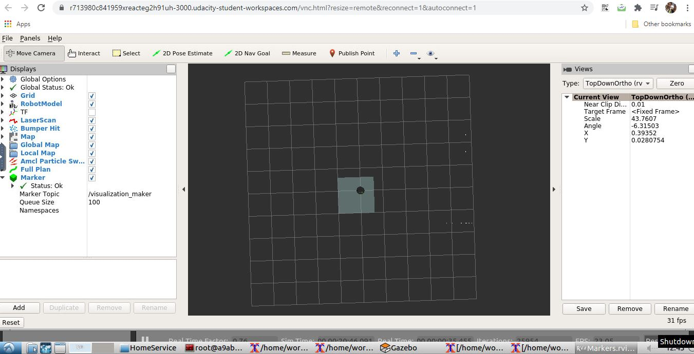
  </div>
 <div style="float:left">
   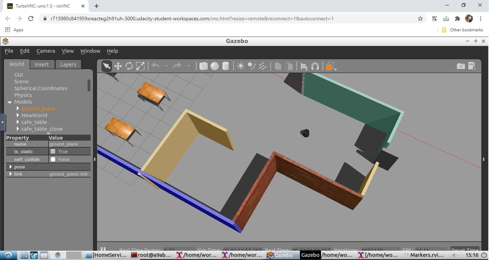
 </div>
</div>
<br/><br/>
The robot is now moves using teleop keyboard all over the enviornment until significant map is seen in Rviz.

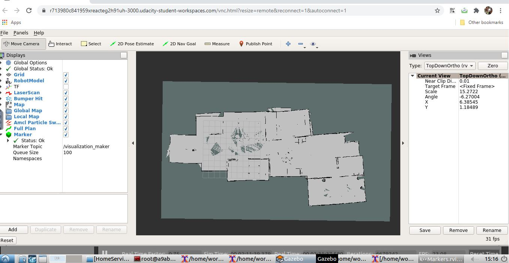

<br/>

Now the map is generated in Rviz. It is saved in the HomeService directory as map.pgm and map.yaml

```
//STEPS TO SAVE MAP
rosrun map_server map_saver
//SAVE WITH CUSTOM MAP NAME 
rosrun map_server map_saver <name_of_map>
```
<br/>


<h3> Module 2: Localization and Navigation using AMCL </h3>

Here we used the map generated by pgm_map_creator package to perform the localization. Launch the test_navigation.sh file to test the navigation. A 2D Nav goal is set in Rviz
and robot moves to the point.

<div class="row">
  <div style="float:left">
   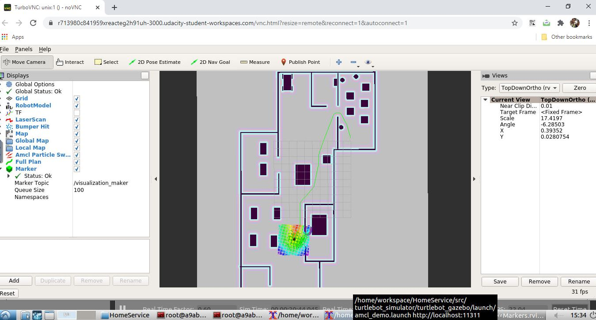
  </div>
 <div style="float:left">
   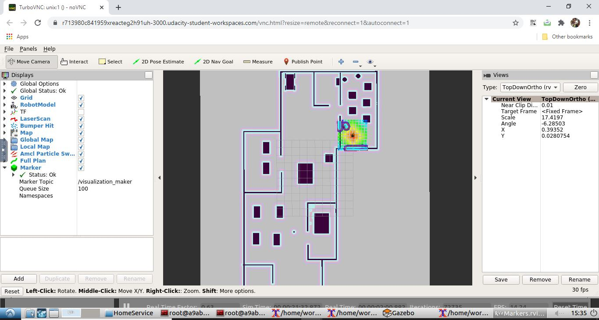
 </div>
</div>

<br/>
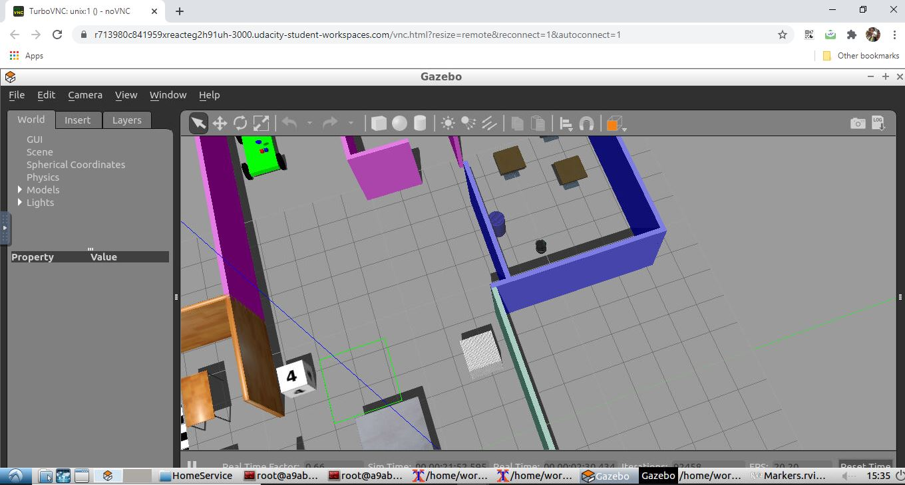
<br/>
<br/>     
<h3>Module 3: Pick Objects (A testing for movement from source to target) </h3>

Here the robot is moved from the starting point(near the entrance) to the pickup point(cafer). Once after it reaches the pickup point it waits for 5 seconds and prints that goal is reached. Now it moves towards the drop off point(conference room). After reaching the drop off it prints reached dropoff zone and node terminates. The pick_objects.sh files is executed which launches the pick_objects node aditionally.
<br/>

<h4> Moving towards pickup </h4>
<br/>

<div class="row">
  <div style="float:left">
   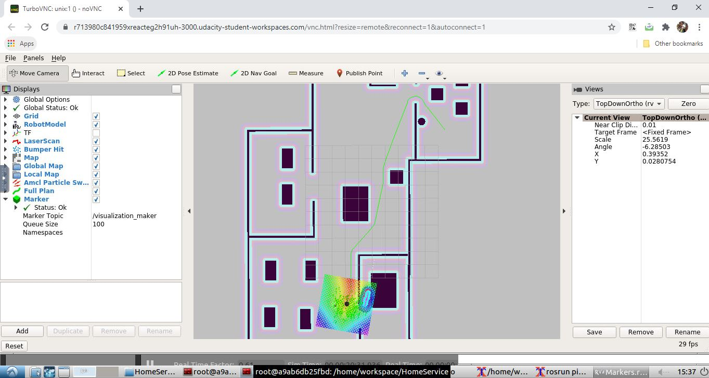
  </div>
 <div style="float:left">
   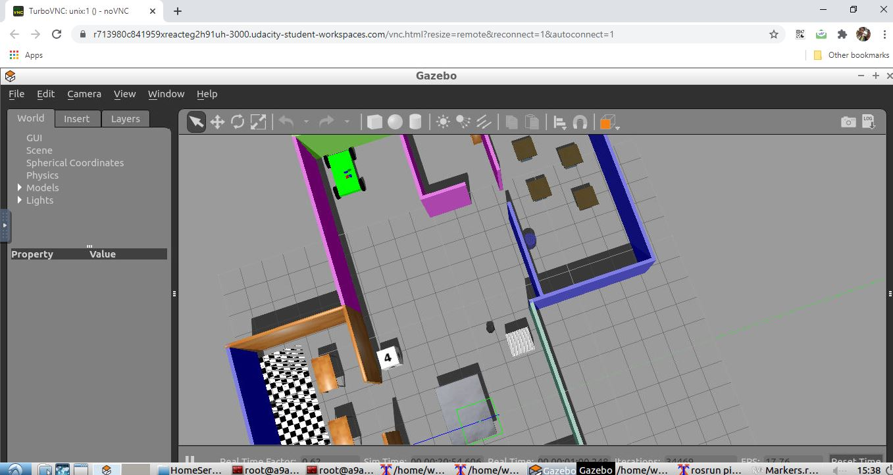
 </div>
</div>

<h4> Moving towards dropoff </h4>

<div class="row">
  <div style="float:left; margin-right:1px">
   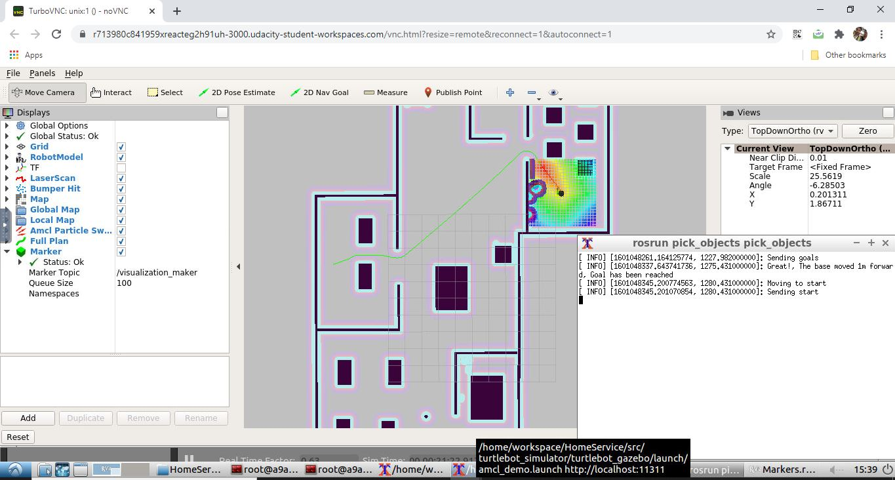
  </div>
 <div style="float:left;margin-right:1px">
   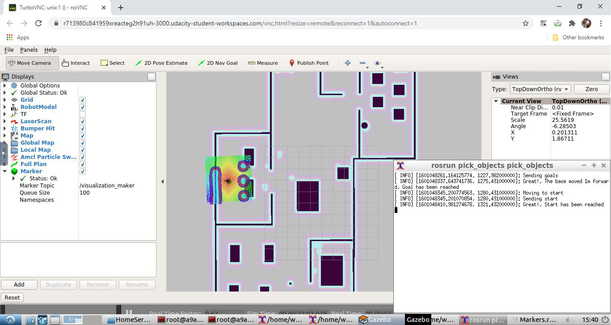
 </div>
</div>

<br/> 
<h4> Drop off reached </h4>
<br/>

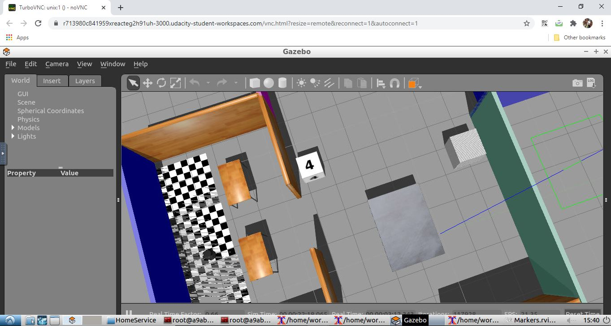

<br/>

<h3> Module 4: Markers testing in RViz </h3>

The add_marker.sh file is executed to test the apperance of marker in the destination point.It launches the add_markersold in additional. The marker remains there for 5 seconds and after that changes color to red and shows
in drop off point for 5 seconds. This loop executed indefinitely.

<br/>
<div class="row">
  <div style="float:left">
   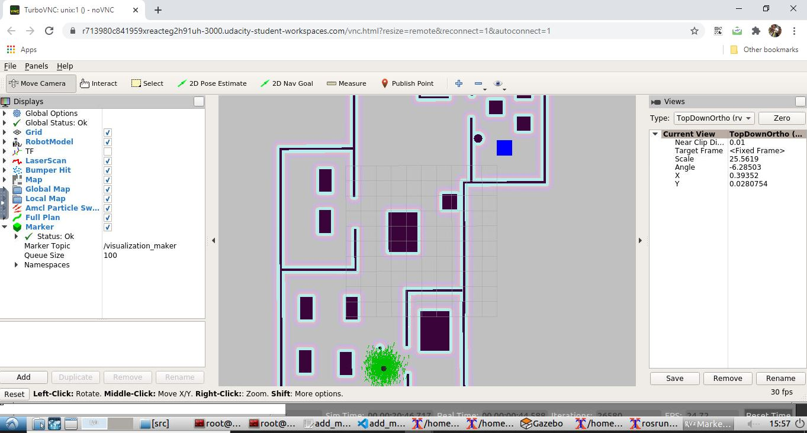
  </div>
 <div style="float:left">
   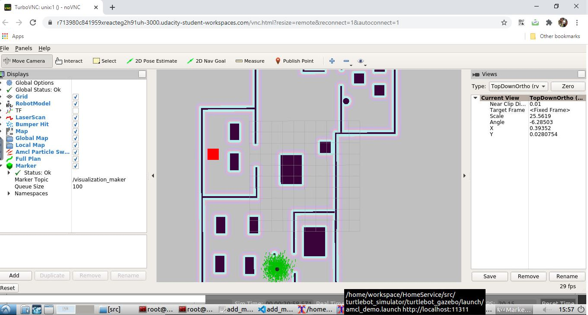
 </div>
</div>

<br/>

<h3> Module 5: Home Service Robot </h3>

 This final module shows the whole system architecture and process flows. The home_service.sh file is executed. This launches the turtlebot, amcl, rviz packages. Along with these the pick_objects node is launched which moves the robot from start to pick up waits there for 5 seconds and moves to drop off points and statys there. This is responsible for localization and movement. The add_markers node shows the marker at the destination as the indication of the object. Once when the robot reaches the destination it disappers and when the robot reaches the drop off point it reappears with different color indicating the object is successfully transferred from pick up to drop off.
 
 <br/>
 
 <h4> Moving towards the pick up point </h4>
 <br/>
 <div class="row">
  <div style="float:left">
   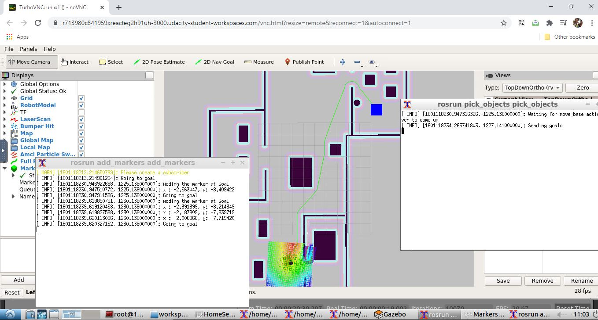
  </div>
 <div style="float:left">
   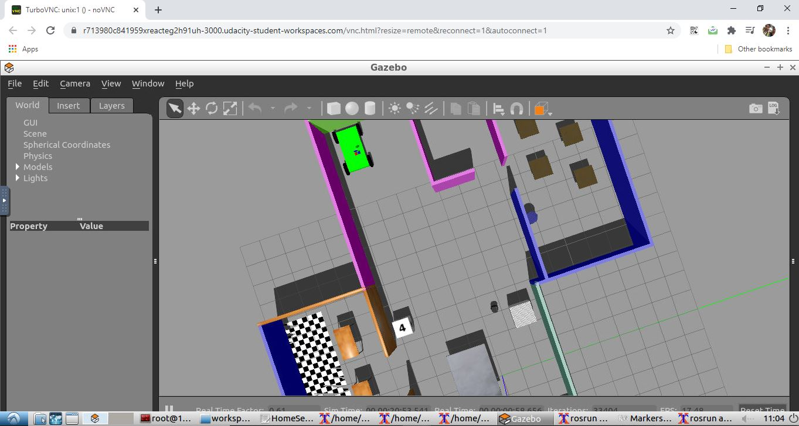
 </div>
</div>
<br/>

<h4> Robot reached the pick up and picked the object (Marker disappeared) </h4>
<br/>
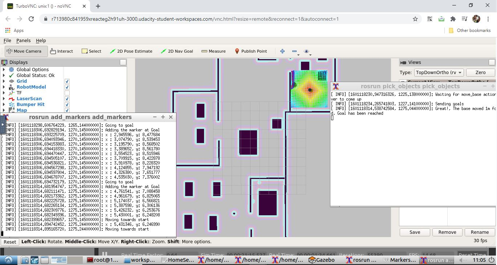
<br/>

<h4> Robot Moving towards the drop off point </h4>
<br/>

<br/>

<h4> Robot Reached the drop off point and puts the object (Markers reappers with new color) </h4>
<br/>
 <div class="row">
  <div style="float:left">
   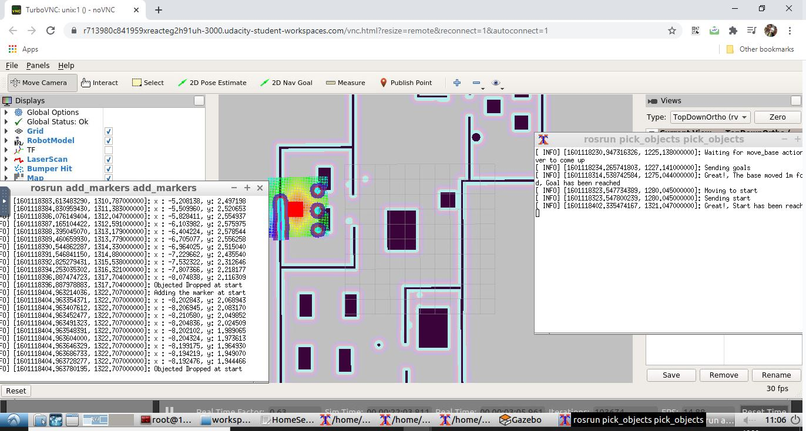
  </div>
 <div style="float:left">
   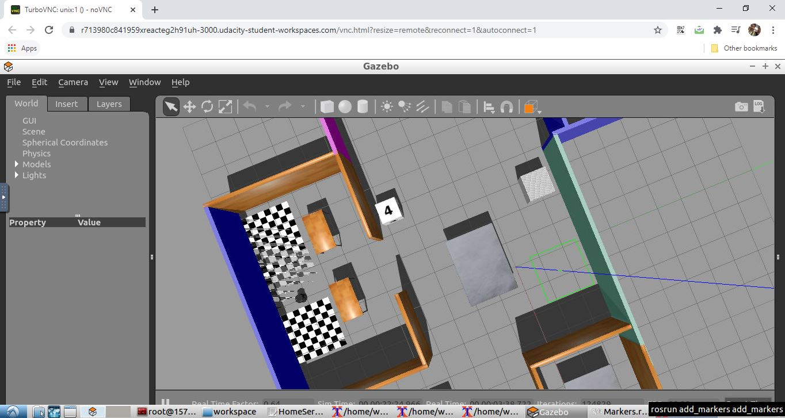
 </div>
</div>
<br/>

